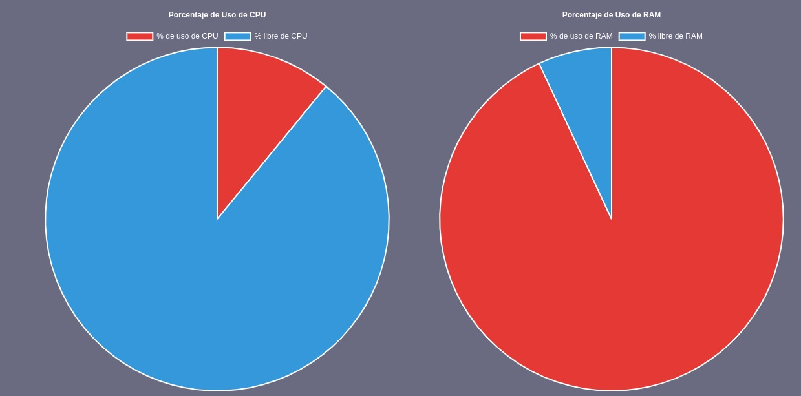
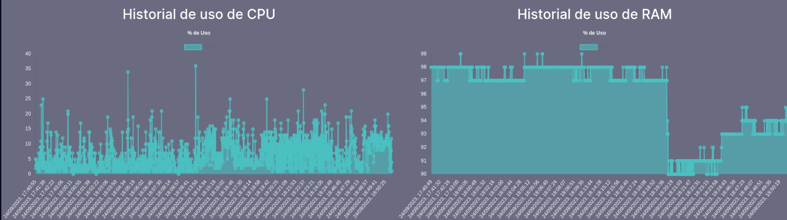

# <div align="center"> MANUAL TECNICO </div>
### <div align="center"> Proyecto 1 - Sistemas Operativos 1</div>
```
Nombre: Allen Giankarlo Román Vásquez
Carnet: 202004745
```

## Máquina Virtual de Monitoreo

### 1. Descripción de la Máquina Virtual de Monitoreo

Esta máquina virtual se encarga de monitorear el estado de las máquinas virtuales que se encuentran en el autoscalling de GCP. Para esto, se utiliza el servicio desarrolado, el cual permite monitorear el estado de las máquinas virtuales, así como también de los servicios que se encuentran corriendo en estas.

### 2. Contenido de la Máquina Virtual

La máquina virtual cuenta con las siguientes características:

- Utiliza Docker Compose para levantar los servicios de contenedores.

- Servicios:
  - Servicio de plataforma de monitoreo (Frontend desarrolado en React): Se encarga de monitorear el estado de las máquinas virtuales, así como también de los servicios que se encuentran corriendo en estas.
  - Servicio de base de datos (Volumen a partir de una imagen de Mysql): Se encarga de almacenar la información de las máquinas virtuales.
  - Servicio de API (Backend desarrolado en NodeJS): Se encarga de exponer los datos de la base de datos a través de una API REST.

### 3. Servicios de la Máquina Virtual

#### 3.1. Servicio de plataforma de monitoreo

Este servicio se encarga de monitorear el estado de las máquinas virtuales, así como también de los servicios que se encuentran corriendo en estas. Para esto, se utiliza una aplicación desarrolada en React, la cual se conecta a la API para obtener los datos de las máquinas virtuales y mostrarlos en la interfaz gráfica.

Ofrece dos tipos de monitoreo de las máquinas virtuales que se encuentran en el autoscalling de GCP.

-Monitoreo en tiempo real: Muestra el estado actual de las máquinas virtuales, así como también de los servicios que se encuentran corriendo en estas, también permite realizar acciones sobre las máquinas virtuales, como por ejemplo **hacerle kill a un servicio que se encuentre corriendo en una máquina virtual.**

<center></center>

-Monitoreo histórico: Muestra el estado de las máquinas virtuales en un periodo de tiempo determinado.

<center></center>

#### 3.2. Servicio de base de datos

Este servicio se encarga de almacenar la información de las máquinas virtuales. Para esto, se utiliza una base de datos Mysql, la cual se encuentra en un contenedor de Docker.

#### 3.3. Servicio de API

Este servicio se encarga de exponer los datos de la base de datos a través de una API REST. Para esto, se utiliza una aplicación desarrolada en NodeJS, la cual se conecta a las máquinas virtuales para obtener los datos de estas y almacenarlos en la base de datos, así como también para obtener los datos de la base de datos y exponerlos a través del servicio de plataforma de monitoreo.

## Máquinas Virtuales a Monitorear

### 1. Descripción de las Máquinas Virtuales a Monitorear

Las máquinas virtuales a monitorear son las que se encuentran en el autoscalling de GCP. Estas máquinas virtuales se encargan de correr los servicios de monitoreo, los cuales son:

- Servicio de monitoreo de CPU a través de módulos de Kernel: Se encarga de monitorear el estado de los módulos de Kernel que se encuentran corriendo en la máquina virtual, así como también de los servicios que se encuentran corriendo en esta.

- Servicio de monitoreo de RAM a través de módulos de Kernel: Se encarga de monitorear el estado de los módulos de Kernel que se encuentran corriendo en la máquina virtual.

Ambos servicios se encargan de enviar los datos de monitoreo a la máquina virtual de monitoreo, la cual se encarga de almacenarlos en la base de datos.

Entre los datos que se envían se encuentran:
- Ip de la máquina virtual.
- Estado de los módulos de Kernel de RAM:
    - Total de RAM.
    - RAM libre.
    - RAM en uso.
    - Porcentaje de RAM en uso.
- Estado de los módulos de Kernel de CPU:
    - Porcentaje de CPU en uso.
    - PID de los procesos que se encuentran corriendo en la máquina virtual.
    - Nombre de los procesos que se encuentran corriendo en la máquina virtual.
    - Estado de los procesos que se encuentran corriendo en la máquina virtual.
    - Usuario de los procesos que se encuentran corriendo en la máquina virtual.
    - % de RAM que está utilizando cada proceso que se encuentra corriendo en la máquina virtual.
    - Padre de los procesos que se encuentran corriendo en la máquina virtual.

### 2. Contenido de las Máquinas Virtuales a Monitorear

Las máquinas virtuales a monitorear cuentan con una API desarrolada en Golang la cual se encarga de monitorear el estado de los módulos de Kernel que se encuentran corriendo en la máquina virtual, así como también de los servicios que se encuentran corriendo en esta. En esta también se encuentra el servicio Killer de procesos, el cual se encarga de matar los procesos que se encuentran corriendo en la máquina virtual.

Las máquinas virtuales a monitorear cuentan con los siguientes servicios:

- API de pruebas desarrolada en Python: Se encarga de realizar pruebas del
Servicio Killer de procesos.


### 3. Automatización de la creación de las Máquinas Virtuales a Monitorear

Para la automatización de la creación de las máquinas virtuales a monitorear se utilizó Autoscalling de GCP, el cual se encarga de crear las máquinas virtuales a partir de una imagen de Docker, así como también de eliminarlas cuando estas no se están utilizando.

## Consideraciones

- Se utilizó Docker Compose para levantar los servicios de contenedores de la máquina virtual de monitoreo.
- Las imágenes de Docker de la máquina virtual de monitoreo se encuentran en Docker Hub.
- Se utilizó Autoscalling de GCP para la creación de las máquinas virtuales a monitorear.

## Extras

Tablas utilizadas en la base de datos mysql:


```
use pr1_so1;

CREATE TABLE IF NOT EXISTS ram_historico (
    id_ram INT AUTO_INCREMENT PRIMARY KEY,
    uso INT NOT NULL,
    ip VARCHAR(50) NOT NULL,
    fecha DATETIME NOT NULL
);

CREATE TABLE IF NOT EXISTS cpu_historico (
    id_cpu INT AUTO_INCREMENT PRIMARY KEY,
    uso INT NOT NULL,
    ip VARCHAR(50) NOT NULL,
    fecha DATETIME NOT NULL
);
  

```


