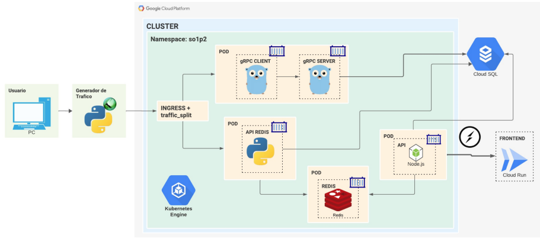
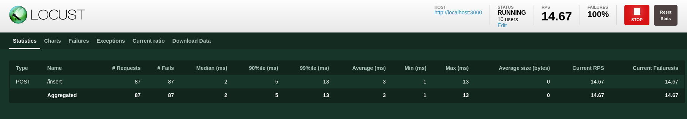
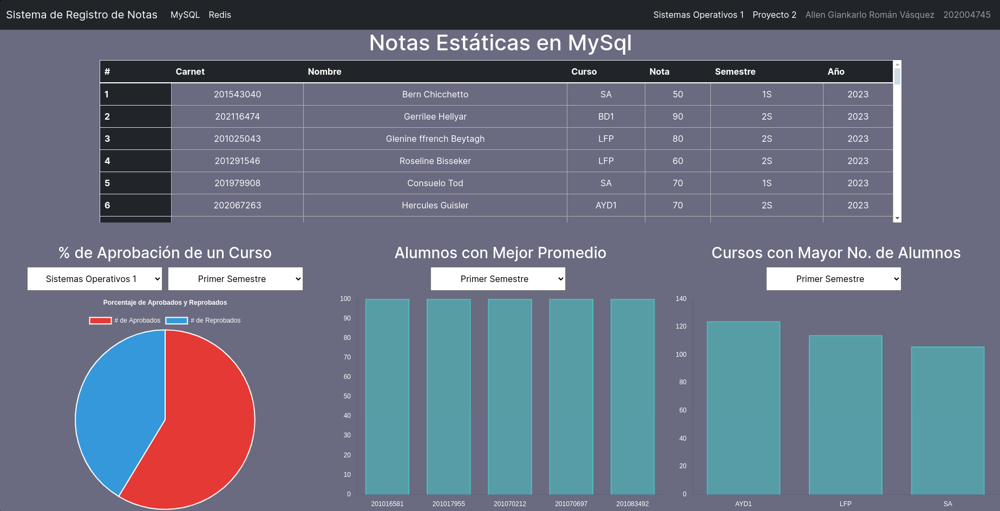
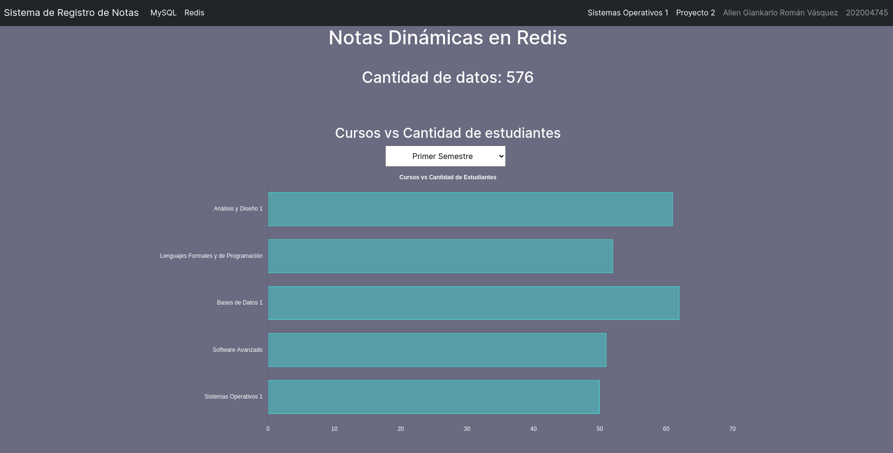

# <div align="center"> MANUAL TÉCNICO </div>
### <div align="center"> Proyecto 2 - Sistemas Operativos 1</div>
```
Nombre: Allen Giankarlo Román Vásquez
Carnet: 202004745
```

# Sistema de Registro de Notas

El objetivo del proyecto es desarrollar un sistema de registro de notas, el cual permita registrar las notas de los estudiantes de una clase, así como también consultarlas, desplegando un clúster de Kubernetes en GCP con sus servicios, conociendo ServerLess por medio de Cloud Run para el despliegue del Frontend; controlando el tráfico por medio de balanceadores de carga; guardando los datos en una base de datos Cloud SQL.

<center></center>

## 1. Generador de Trafico

Programa desarrolado en Python con ayuda de Locust, el cual se encarga de generar tráfico a la aplicación de registro de notas, para esto, se utilizó un archivo de configuración en el cual se especifica la cantidad de usuarios que se van a simular, así como también la cantidad de peticiones que se van a realizar por cada usuario.


### 1.1. Configuración de Locust

Para el tráfico generado por Locust se utilizó el siguiente json:

```
{
    "carnet": 233233,
    "nombre": "Alumno 1",
    "curso": "SO1",
    "nota": 90,
    "semestre": "2S",
    "year": 2023
}
```

Donde:

Los Cursos a Monitorear pueden ser:

- SO1 - Sistemas Operativos 1
- BD1 - Sistemas de Bases de Datos 1
- LFP - Lenguajes Formales y de Programación
- SA - Software Avanzado
- AYD1 - Análisis y Diseño 1

La descripción para semestre puede se:
- 1S - Primer Semestre.
- 2S - Segundo Semestre.

Año: 2023

Nota: 50, 60, 70, 80, 90, 100.

<center></center>

### 2. Servicios en el Clúster de Kubernetes

#### 2.1. Servicio de Ingress con Balanceador de Carga (Nginx)

Se encarga de redirigir el tráfico a dos servicios que se encuentran en el clúster de Kubernetes que se encargan de registrar las notas de los estudiantes, generando dos rutas, una para cada servicio.

Nginnx se encarga de redirigir el tráfico a los servicios de registro de notas, los cuales se encuentran en el clúster de Kubernetes.

Manifiesto de Kubernetes:

[`ingress.yaml`](../cluster/k8s/ingress/ingress.yml`)

#### 2.2. Api Redis (Python)

Se encarga de registrar las notas de los estudiantes en una base de datos Redis, la cual se encuentra en un contenedor de Docker que es tulizada como base de datos dinámica; también guarda los datos en una base de datos MySQL, la cual se encuentra en Google Cloud SQL.

Manifiesto de Kubernetes (Deployment y Service):

Deployment: [`redis-deployment.yaml`](../cluster/k8s/deployments/Python.yml)

Service: [`redis-service.yaml`](../cluster/k8s/services/serviceNode.yml)

#### 2.3. Grpc-Client y Grpc-Server (Golang)

Se encarga de registrar las notas de los estudiantes en una base de datos MySQL, la cual se encuentra en Google Cloud SQL.

Grpc-Client realiza las peticiones a Grpc-Server, el cual se encarga de registrar las notas de los estudiantes en una base de datos MySQL, la cual se encuentra en Google Cloud SQL.

Manifiesto de Kubernetes (Deployment y Service):

Deployment: [`grpc-deployment.yaml`](../cluster/k8s/deployments/Grpc.yml)

Service: [`grpc-service.yaml`](../cluster/k8s/services/serviceGrpc.yml)

#### 2.4. Redis

Se encarga de almacenar los datos de los estudiantes en una base de datos Redis, la cual se encuentra en un contenedor de Docker que es utlizada como base de datos dinámica.

Manifiesto de Kubernetes (Deployment y Service):

Deployment: [`redis-deployment.yaml`](../cluster/k8s/deployments/redis.yml)

Service: [`redis-service.yaml`](../cluster/k8s/services/serviceRedis.yml)

#### 2.5. Backend (NodeJS)

Se encarga de manejar las peticiones que se realizan a la aplicación de registro de notas por parte del frontend, así como también de realizar las peticiones a las bases de datos para obtener los datos de los estudiantes tanto de Redis como de MySQL. Se comunica con el Frontend a través de un socket.

Manifiesto de Kubernetes (Deployment y Service):

Deployment: [`backend-deployment.yaml`](../cluster/k8s/deployments/Node.yml)

Service: [`backend-service.yaml`](../cluster/k8s/services/serviceNode.yml)

#### 2.6. Secrets utilizados en el Clúster de Kubernetes

Se encarga de almacenar las variables de entorno que se utilizan en el clúster de Kubernetes.

Docker Hub: [`secrets.yaml`](../cluster/k8s/secrets/sDockerHubPull.yml)

Grpc: [`secrets.yaml`](../cluster/k8s/secrets/sGrpc.yml)

Node: [`secrets.yaml`](../cluster/k8s/secrets/sNode.yml)

Python: [`secrets.yaml`](../cluster/k8s/secrets/sPython.yml)

#### 2.7. Horizontal Pod Autoscaler

Cada uno de los servicios que se encuentran en el clúster de Kubernetes cuentan con un Horizontal Pod Autoscaler, el cual se encarga de escalar los pods de los servicios de acuerdo a la carga que se tenga en estos, con un mínimo de 1 pod y un máximo de 3 pods, creando un nuevo pod cuando la carga del cpu de los pods actuales sea mayor al 50% y eliminando un pod cuando la carga de los pods actuales sea menor al 50%.

Manifiesto de Kubernetes:

[`hpa.yaml`](../cluster/k8s/hpa/hpa.yaml)

### 3. Frontend

#### 3.1. Frontend (React Vite)

Se encarga de mostrar la interfaz gráfica de la aplicación de registro de notas, así como también de realizar las peticiones al Backend para obtener los datos de los estudiantes.

El servicio de Frontend se encuentra en Cloud Run, el cual se comunica con el Backend a través de un socket.

Cuenta con dos vistas:

- Vista de MySQL: Muestra los datos de los estudiantes que se encuentran en la base de datos MySQL que es el almacenamiento persistente, en la vista se puede encontrar:
    - Tabla con los datos de los estudiantes.
    - Gráfica de Pastel con el porcentaje de estudiantes que aprobaron y reprobaron, filtrando por curso y semestre.
    - Gráfica de barras con el top 5 de promedios de estudiantes, filtrando por semestre.
    - Gráfica de barras con el top 3 de cursos con más estudiantes, filtrando por semestre.

<center></center>

- Vista de Redis: Muestra los datos de los estudiantes que se encuentran en la base de datos Redis que es el almacenamiento dinámico, en la vista se puede encontrar:
    - Label con la cantidad de estudiantes que se encuentran en la base de datos Redis.
    - Gráfica de Curso vs Cantidad de Estudiantes, filtrando por semestre.

<center></center>

### 4. Servicios en Google Cloud

#### 4.1. Cloud SQL

Se encarga de almacenar los datos de los estudiantes en una base de datos MySQL, la cual se encuentra en Google Cloud SQL.

La tabla utilizada en la base de datos es la siguiente:

```
CREATE TABLE IF NOT EXISTS nota (
    id INT AUTO_INCREMENT PRIMARY KEY,
    carnet BIGINT NOT NULL,
    anio INT NOT NULL,
    nombre VARCHAR(255) NOT NULL,
    curso VARCHAR(35) NOT NULL,
    nota INT NOT NULL,
    semestre VARCHAR(5) NOT NULL
);
```

#### 4.2. Container Registry

Se encarga de almacenar las imagen de Docker utilizada en Cloud Run para el despliegue del Frontend.

Dockerfile: [`Dockerfile`](../Frontend/Dockerfile)

#### 4.3. Cloud Run

Se encarga de desplegar el Frontend de la aplicación de registro de notas, el cual se comunica con el Backend a través de un socket.

#### 4.4. Kubernetes Engine

Se encarga de desplegar el clúster de Kubernetes, el cual se encarga de desplegar los servicios de la aplicación de registro de notas, así como también de almacenar los datos de los estudiantes en una base de datos Redis, la cual se encuentra en un contenedor de Docker que es utlizada como base de datos dinámica.

