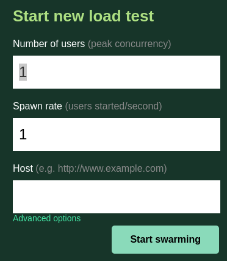
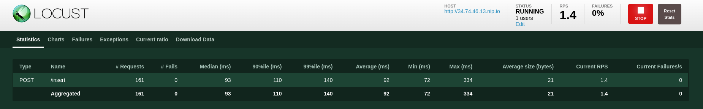

# <div align="center"> MANUAL DE USUARIO </div>
### <div align="center"> Proyecto 2 - Sistemas Operativos 1</div>
```
Nombre: Allen Giankarlo Román Vásquez
Carnet: 202004745
```

# Sistema de Registro de Notas

El objetivo del proyecto es desarrollar un sistema de registro de notas, el cual permita registrar las notas de los estudiantes de una clase, consultando las notas desde una base de datos MySQL y una base de datos Redis, mostrando las consultas en una interfaz gráfica desarrolada en React.

<center></center>

## 1. Generador de Tráfico

El generador de tráfico ayuda a hacer pruebas de carga a la aplicación de registro de notas, para esto, se utilizó un archivo con jsons en el cual se especifica la cantidad de usuarios que se van a simular, así como también la cantidad de peticiones que se van a realizar por cada usuario.


### 1.1. Cómo utilizar el generador de tráfico

Para utilizar el generador de tráfico se debe de ejecutar el siguiente comando:

```
locust -f traffic.py
```

Luego, se debe de acceder a la interfaz gráfica de Locust, la cual se encuentra en la siguiente dirección:

```
http://localhost:8089/
```

### 1.2. Configuración de Locust

Para iniciar un nuevo load test se debe de llenar los siguientes campos:

- Number of total users to simulate: Cantidad de usuarios que se van a simular.

- Spawn rate (users spawned/second): Cantidad de usuarios que se van a simular por segundo.

- Host: Dirección de la aplicación de registro de notas.

Después de llenar los campos, se debe de dar click en el botón de Start Swarming.

<center></center>

### 1.3. Configuración de los Jsons

Para el tráfico generado por Locust se utilizó el siguiente json:

```
{
    "carnet": 233233,
    "nombre": "Alumno 1",
    "curso": "SO1",
    "nota": 90,
    "semestre": "2S",
    "year": 2023
}
```

Donde:

Los Cursos a Monitorear pueden ser:

- SO1 - Sistemas Operativos 1
- BD1 - Sistemas de Bases de Datos 1
- LFP - Lenguajes Formales y de Programación
- SA - Software Avanzado
- AYD1 - Análisis y Diseño 1

La descripción para semestre puede se:
- 1S - Primer Semestre.
- 2S - Segundo Semestre.

Año: 2023

Nota: 50, 60, 70, 80, 90, 100.

### 1.4 Resultados

Luego de darle clic al botón de Start Swarming, se puede observar los resultados de las pruebas de carga en la interfaz gráfica de Locust.

<center></center>

## 2. Frontend

Se encarga de mostrar la interfaz gráfica de la aplicación de registro de notas, así como también de realizar las peticiones al Backend para obtener los datos de los estudiantes.

El servicio de Frontend se puede encontrar en la siguiente dirección:

```
https://frontend-pr2-bz7ufpzuma-ue.a.run.app
```

Cuenta con dos vistas:

- Vista de MySQL: Muestra los datos de los estudiantes que se encuentran en la base de datos MySQL que es el almacenamiento persistente, en la vista se puede encontrar:
    - Tabla con los datos de los estudiantes.
    - Gráfica de Pastel con el porcentaje de estudiantes que aprobaron y reprobaron, filtrando por curso y semestre.
    - Gráfica de barras con el top 5 de promedios de estudiantes, filtrando por semestre.
    - Gráfica de barras con el top 3 de cursos con más estudiantes, filtrando por semestre.

<center></center>

- Vista de Redis: Muestra los datos de los estudiantes que se encuentran en la base de datos Redis que es el almacenamiento dinámico, en la vista se puede encontrar:
    - Label con la cantidad de estudiantes que se encuentran en la base de datos Redis.
    - Gráfica de Curso vs Cantidad de Estudiantes, filtrando por semestre.

<center></center>

