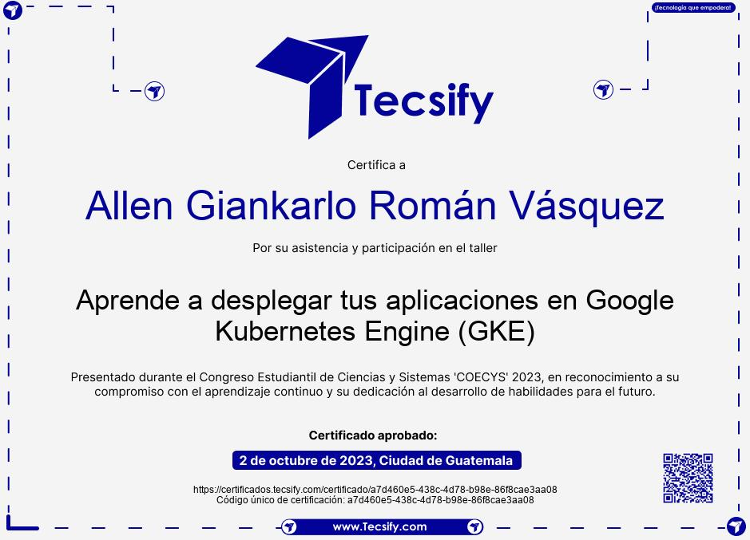

# **Resumen COECYS**

# **Allen Giankarlo Román Vásquez - 202004745**

# **Aprende a desplegar tus aplicaciones en Google Kubernetes Engine.**

Kubernetes busca la automatización y configuración declarativa, kubernetes a diferencia de una arquitectura monolítica que busca tener una aplicación grande que contenga todas las funcionalidades, Kubernetes utiliza microservicios que dividen una aplicación en componentes más pequeños y autónomos que buscan que las aplicaciones sean resistentes a fallos, la cantidad de microservicios puede ser muy grande, por ejemplo, 1000, pero va a depender de nuestro recurso.

Uno de los problemas de Kubernetes es la gestión de servicios, pero aún así ayuda a gestionarla.

Entre las propuestas de valor que ofrece Kubernetes es orquestar contenedores con múltiples host, escala fácilmente, permite optimizar y automatizar.

Para desplegar Kubernetes encontramos:

- Pods: son los objetos más pequeños, representan una instancia.

- Controllers: administran y escalan pods.

- Namespaces: forma de dividir un clúster en múltiples clústers virtuales.

- Services: definen un conjunto lógico de pods y una política para acceder en ellos.

## **Certificado**

  

