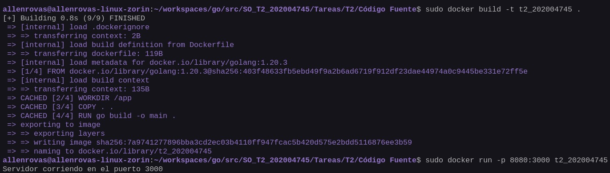
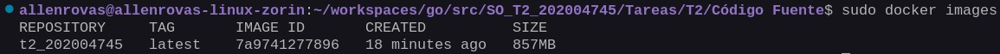
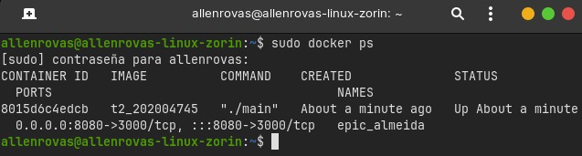
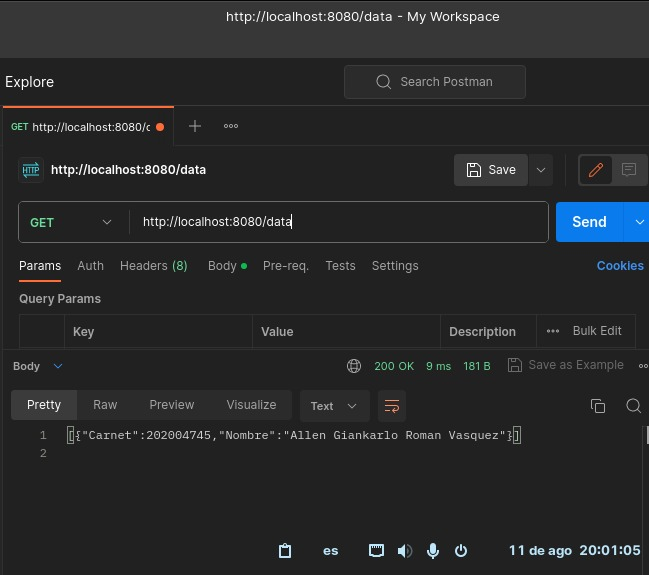

# **Tarea 2**

# **Allen Giankarlo Román Vásquez - 202004745**

### **Captura de los Comandos que utilizo para crear la imagen y comando para correrlo.**

  

### **Captura de la imagen creada, por medio del comando docker images.**

  

### **Captura del contenedor corriendo, por medio del comando docker ps.**

  

### **Captura de postman en la cual se pueda visualizar los datos del estudiante al igual que la fecha y hora.**

  

